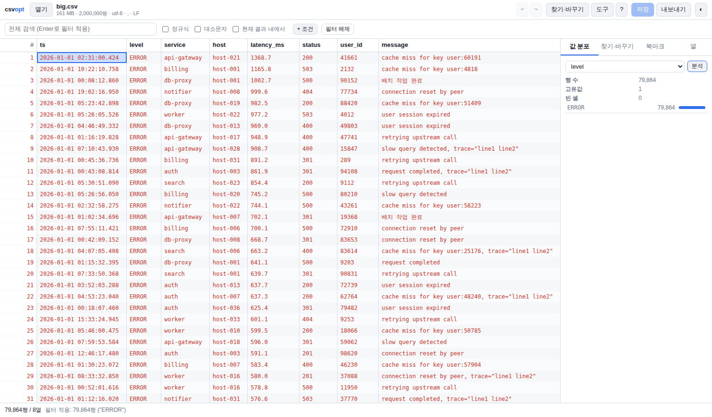
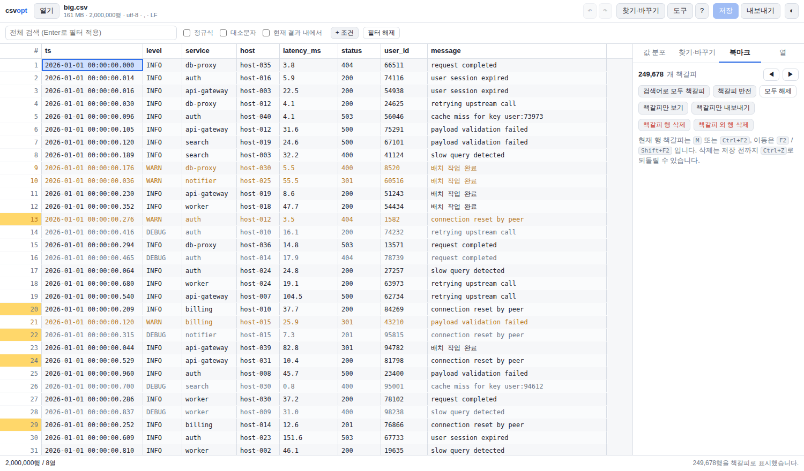

# csvopt — 대용량 CSV / 로그 편집기

수 GB~수십 GB짜리 로그 CSV를 **통째로 메모리에 올리지 않고** 열어서 보고, 걸러내고, 고치고, 내보내는 도구입니다.
파이썬 표준 라이브러리만 사용하므로 설치할 패키지가 없고, **Windows·macOS·Linux에서 동일하게** 동작합니다.
UI는 로컬에서만 뜨는 작은 웹 서버 + 브라우저 화면입니다(외부로 나가는 통신 없음).



검색어에 맞는 행을 한 번에 책갈피로 남긴 모습 (행 번호가 노란색):



## 빠른 시작

필요한 것: **Python 3.9 이상** + 아무 브라우저.

### Windows

1. 이 폴더를 원하는 위치에 두고
2. `run.bat` 을 더블클릭 → 브라우저가 열리고 파일 선택 창이 뜹니다.
   * CSV 파일을 **`run.bat` 위로 끌어다 놓으면** 그 파일이 바로 열립니다.
   * 명령 프롬프트에서: `py -3 -m csvopt C:\logs\app.csv`

### macOS

1. `run.command` 를 더블클릭 (처음 한 번은 우클릭 → 열기)
   * 터미널에서: `python3 -m csvopt ~/logs/app.csv`
   * 실행 권한이 없다면 `chmod +x run.command`

### 어디서든

```bash
python3 -m csvopt                 # 파일 없이 열고 UI에서 선택
python3 -m csvopt app.csv         # 바로 열기
python3 -m csvopt app.csv --port 8765 --no-browser
pip install -e .                  # 선택: csvopt 명령으로 설치
```

주소에는 1회용 토큰이 붙습니다(`http://127.0.0.1:<포트>/?t=...`). 127.0.0.1에만 바인딩하고 토큰이
없는 요청은 거부하므로, 같은 네트워크의 다른 사람이 열 수 없습니다.

## 무엇이 되나

**보기**

* 4.7 GB / 6천만 행 로그를 **한 번 인덱싱(약 20초)하면 이후에는 0.7초에 열리고**,
  스크롤은 어디로 튀든 1 ms 내외입니다 (아래 성능 참고)
* 가상 스크롤 그리드, 행 번호 고정, 열 너비 자동 맞춤 · 드래그 조절 · 왼쪽 고정 · 숨기기
* `level` / `severity` 열을 자동으로 찾아 ERROR·FATAL은 빨강, WARN은 주황으로 표시
* 라이트/다크 테마, 행 높이 3단계(줄바꿈 보기 포함)

**찾기**

* 상단 전체 검색(부분 일치 / 정규식 / 대소문자 구분) — Enter 한 번이면 파일 전체를 훑습니다
* 열 단위 조건 칩: 포함·일치·시작·끝·정규식·`>`·`≥`·`<`·`≤`·수치 범위·**시간 범위**·목록·빈 값·NOT
* "현재 결과 내에서" 를 켜면 이미 걸러진 결과 안에서 다시 좁혀 들어갑니다
* 값 분포(facet) 패널: 열 하나의 고유값 top 30 + 개수 + 막대, 값을 클릭하면 그 값으로 바로 필터
* 숫자 열이면 최소/최대/평균/숫자 셀 개수까지 같이 계산
* 오래 걸리는 작업은 진행률이 뜨고 **취소** 버튼이 있습니다

**책갈피 (Notepad++ 방식)**

* 찾기 패널의 **"모두 책갈피"** — 검색어에 일치하는 모든 행을 한 번에 책갈피로 표시 (Mark All)
* **책갈피 반전** — 표시된 행과 안 된 행을 서로 뒤집기
* **책갈피 행 삭제** / **책갈피 외 행 삭제** — 원하는 행만 남기거나 걸러낸 행만 지우기
* **책갈피만 보기**, **책갈피만 내보내기** — 표시한 행만 화면에 두거나 별도 파일로 저장
* <kbd>F2</kbd> 다음 책갈피, <kbd>Shift+F2</kbd> 이전, <kbd>M</kbd> 또는 <kbd>Ctrl+F2</kbd> 토글
* 셀 우클릭 → "이 값으로 모두 책갈피" 로 같은 값을 가진 행 전부 표시
* 6천만 행에서 60만 행을 표시하는 데 0.3초, 표시 안 된 5,940만 행을 지우는 데 0.7초,
  실행 취소도 0.3초 — 저장 전까지는 원본 파일이 그대로입니다

**고치기**

* 셀 더블클릭 또는 그냥 타이핑해서 편집, Enter는 아래로 Tab은 오른쪽으로
* 범위 선택 후 복사(TSV) / 붙여넣기(여러 셀 한 번에) / 아래로 채우기 / 비우기
* 행 삽입·복제·삭제, 열 추가·이름변경·순서변경·삭제
* 찾기·바꾸기(정규식, 셀 전체 일치, 열 지정, 현재 결과만) — 수만 셀도 한 번의 실행 취소로 되돌아감
* 중복 행 제거, 앞뒤 공백 다듬기
* 실행 취소/다시 실행 100단계, 북마크(M), 행으로 이동
* **저장하기 전까지 원본 파일은 건드리지 않습니다.** 수정은 메모리 오버레이에만 쌓입니다

**내보내기**

* 저장(원본 덮어쓰기, 기본으로 `.bak` 백업 생성)
* 다른 이름으로 저장: 인코딩(UTF-8 / UTF-8+BOM / CP949 / CP932), 구분자, 줄바꿈(CRLF·LF) 선택,
  **현재 필터 결과만 저장** 옵션 — 5천만 행에서 에러 행만 뽑아 동료에게 보내는 용도

## 단축키

Windows/Linux는 `Ctrl`, macOS는 `⌘` 입니다. UI의 `?` 버튼에서도 볼 수 있습니다.

| 키 | 동작 |
|---|---|
| `↑ ↓ ← →` (`Shift`) | 셀 이동 / 범위 선택 |
| `Enter`, `F2` | 편집 시작 · 편집 후 아래 칸으로 |
| `Ctrl/⌘ + C`, `V` | 복사 / 붙여넣기 (여러 셀) |
| `Ctrl/⌘ + D` | 선택 범위 아래로 채우기 |
| `Delete` | 선택 셀 비우기 |
| `Ctrl/⌘ + Z`, `Shift+Z` | 실행 취소 / 다시 실행 |
| `Ctrl/⌘ + F`, `Enter` | 찾기 패널 / 다음 결과 |
| `Ctrl/⌘ + G` | 행 번호로 이동 |
| `Ctrl/⌘ + S`, `O` | 저장 / 파일 열기 |
| `Ctrl/⌘ + +`, `-` | 행 삽입 / 선택 행 삭제 |
| `M`, `Ctrl/⌘ + F2` | 책갈피 토글 |
| `F2` / `Shift+F2` | 다음 / 이전 책갈피 |

## 명령줄에서도

UI 없이 쓸 수 있는 하위 명령이 있습니다. 배치 처리나 원격 서버에서 유용합니다.

```bash
python3 -m csvopt info app.csv                     # 인코딩·구분자·행 수·열 미리보기
python3 -m csvopt grep app.csv -w level=ERROR -o errors.csv
python3 -m csvopt grep app.csv -c "timeout" --op contains
python3 -m csvopt grep app.csv -e "user:\d{5}"     # 정규식
python3 -m csvopt convert app.csv -o excel.csv --encoding utf-8-sig --newline crlf
```

## 성능

4코어 리눅스 컨테이너에서 측정했습니다. 두 파일 모두 8열짜리 로그입니다.

| 작업 | 161 MB / 200만 행 | 4.7 GB / 6,000만 행 |
|---|---|---|
| 처음 열기(인덱싱) | 0.6초 | 약 20초 (250 MiB/s 내외) |
| 다시 열기(인덱스 캐시) | 즉시 | 0.7초 |
| 임의 위치 200행 읽기 | 1.2 ms | 1.0 ms |
| `level = FATAL` 필터 | 0.4초 | 13초 |
| 검색 결과 모두 책갈피 | 0.01초 | 0.3초 |
| 책갈피 외 행 전부 삭제 | 0.03초 | 0.7초 (5,940만 행) |
| 삭제 실행 취소 | 0.01초 | 0.3초 |
| 인덱스 캐시 파일 | 15 MB | 458 MB (행당 8바이트) |

메모리는 파일 크기와 무관하게 **50 MB 내외**입니다. 인덱스는 디스크에 두고 메모리 맵으로
읽기 때문에, 전체 스캔을 한 뒤 RSS가 수백 MB로 보이더라도 그것은 OS가 언제든 회수할 수 있는
페이지 캐시이지 프로세스가 붙들고 있는 메모리가 아닙니다.

10 GB 파일이라면 처음 열 때 약 40~50초 인덱싱(진행률 표시와 취소 가능), 그 뒤로는 즉시 열립니다.

## 동작 방식

* **오프셋 인덱스** — 파일을 한 번 훑어 모든 레코드의 시작 바이트를 기록합니다. 따옴표 안의
  줄바꿈, `""` 이스케이프, 따옴표가 아닌 위치의 `"` 문자를 RFC 4180대로 구분하므로 로그에 섞인
  스택트레이스도 한 행으로 유지됩니다. 인덱스는 메모리가 아니라 `<파일>.csvidx` 에 바로 흘려
  쓰고 **메모리 맵으로 읽습니다**. 그래서 6천만 행이든 1억 행이든 프로세스 메모리는 그대로이고,
  두 번째부터는 스캔 없이 즉시 열립니다(파일 크기·수정시각이 바뀌면 자동 무효화).
* **편집 오버레이** — 바뀐 셀만 `{행: {열: 값}}`으로 들고 있고, 삭제 여부는 행당 1비트짜리
  비트셋, 위치 계산은 8192행 블록 단위 Fenwick 트리로 처리합니다. 그래서 5,940만 행을 지워도
  7 MB 남짓이고 실행 취소도 스냅샷 하나로 끝납니다.
* **블록 리터럴 필터** — `level = ERROR` 처럼 반드시 포함돼야 하는 문자열이 있는 조건은,
  레코드를 한 줄씩 파싱하는 대신 4 MB 블록을 통째로 `bytes.find` 로 훑고 걸린 지점만
  인덱스로 되짚어 파싱합니다. 같은 조건에서 6배 빠르며, 결과가 느린 경로와 완전히 같은지
  테스트로 검증합니다.
* **작업(job) 큐** — 오래 걸리는 스캔은 백그라운드 스레드에서 돌고 UI는 진행률을 폴링합니다.
  어떤 스캔이든 중간에 취소할 수 있습니다.

## Windows / macOS 관련 메모

* **인코딩**: BOM이 있으면 그대로 따르고, 없으면 UTF-8 → CP949 → CP932 → CP1252 순으로 판별합니다.
  **저장할 때 원본 인코딩을 그대로 유지**하므로 BOM이 없던 파일에 BOM이 생기는 일은 없습니다.
  Excel에서 한글이 깨지면 내보내기에서 `UTF-8 (BOM 포함)` 또는 `CP949`를 고르세요.
* **줄바꿈**: 원본이 CRLF면 CRLF로, LF면 LF로 저장합니다(내보내기에서 변경 가능).
* **Excel이 파일을 열고 있으면** Windows에서는 덮어쓰기가 실패합니다. 이 경우 "다른 프로그램이
  파일을 잡고 있다"는 메시지를 보여주니 Excel을 닫고 다시 저장하세요.
* **경로**: UI의 파일 열기 창이 서버 쪽 디렉터리를 직접 탐색합니다. Windows에서는 드라이브 문자
  (`C:\`, `D:\`)가, macOS에서는 홈·데스크톱·다운로드·`/Volumes`가 바로가기로 나옵니다.
* macOS에서 `run.command` 가 "확인되지 않은 개발자" 로 막히면 우클릭 → 열기 를 한 번 해주세요.

## 개발

```bash
python3 -m unittest discover -s tests -t .      # 97개 테스트
python3 tools/make_sample_log.py sample.csv --rows 2000000   # 시험용 로그 생성
```

```
csvopt/
  index.py    파일 스캔 · 인코딩/구분자/줄바꿈 판별 · 메모리 맵 인덱스 캐시
  bitset.py   행 비트셋 (책갈피 · 삭제 표시)
  table.py    행 시퀀스(비트셋 + 블록 Fenwick) · 편집 오버레이 · 책갈피 · 실행취소 · 저장
  ops.py      필터 · 정렬 · 통계 · 찾기/바꾸기 · 중복제거
  jobs.py     진행률과 취소가 가능한 백그라운드 작업
  server.py   localhost 전용 HTTP API (토큰 인증)
  cli.py      open / info / grep / convert
  web/        UI (의존성 없는 순수 JS)
```

## 대용량 파일을 다룰 때

* **디스크 여유**: 인덱스 캐시는 행당 8바이트입니다(1억 행 ≈ 800 MB). 원본 옆에 만들 수 없으면
  임시 폴더에 만들고, 그것도 막히면 메모리에 둡니다. 캐시를 아예 만들지 않으려면
  `python3 -m csvopt open big.csv --no-cache` 로 실행하세요.
* **저장**: 저장은 파일 전체를 다시 쓰므로 같은 디스크에 원본 크기만큼 여유가 필요합니다
  (부족하면 저장을 시작하기 전에 알려줍니다). `.bak` 백업까지 켜면 두 배가 필요하니
  10 GB급 파일에서는 백업 체크를 끄거나 "다른 이름으로 저장"을 쓰는 편이 낫습니다.
* **원본을 건드리지 않는 작업 흐름**: 필터 → 책갈피 → "책갈피만 내보내기" 는 원본을 전혀
  다시 쓰지 않으므로 수십 GB 로그에서도 가장 빠릅니다.

## 알려진 한계

* 전체 정렬은 기본적으로 500만 행까지만 허용합니다(그 이상은 먼저 필터로 줄인 뒤 정렬).
* 중복 행 제거는 서로 다른 값 500만 개까지만 추적합니다(그 이상은 범위를 좁혀야 합니다).
* 정규식 검색·필터는 블록 선필터가 걸리지 않아 파일 전체를 파싱합니다
  (161 MB 기준 약 8초, 4.7 GB면 몇 분). 가능하면 열을 지정한 문자열 조건을 먼저 걸어 좁히세요.
* 여러 코어를 쓰지 않습니다. 필터는 아직 단일 스레드입니다.
* 한 번에 한 파일만 엽니다(탭/분할 보기는 아직 없음).
